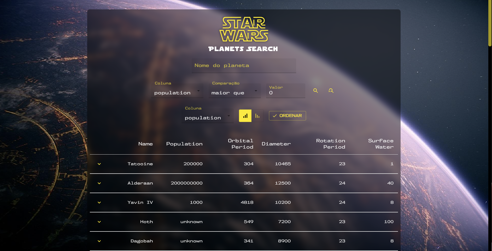
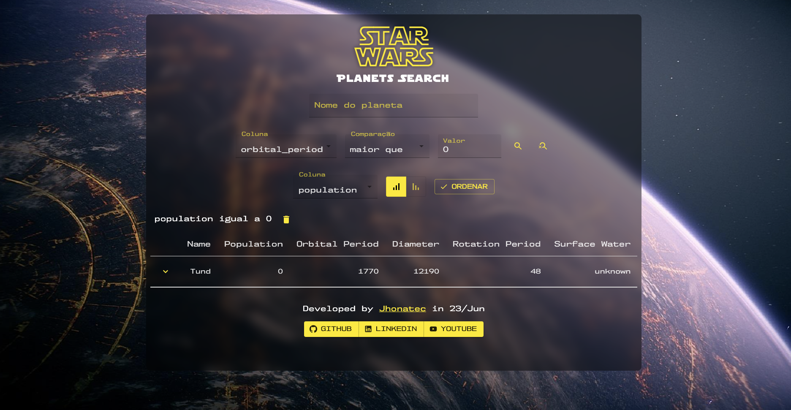
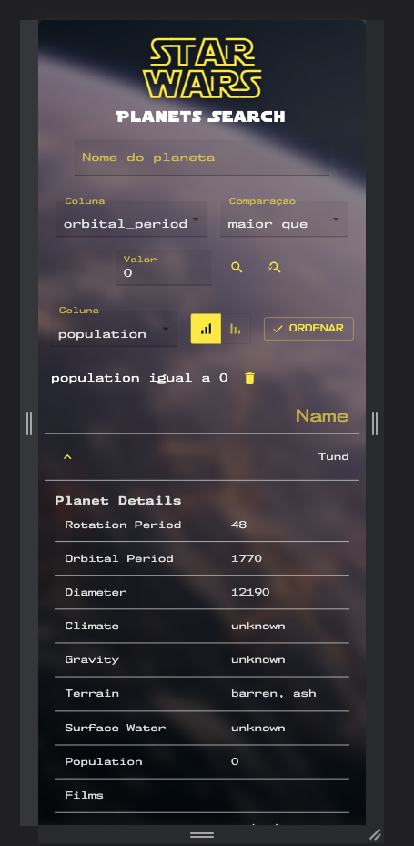

# StarWars - Planet Search with React and Hooks - by Jhonatec

Application that uses the Planets API from StarWars movies to fill a data table and allow to filter the content data

## Watch online

<a href="https://starwars.jhonatec.dev/" target="_blank">Click here to open preview</a>

  

    
    
  

  

# Functionalities

- Loop throught the API to seek every planet listed
- Cross to films endpoint to show movie titles instead of links
- Resize table to mobile experience
- Sound effects 😎

# Technologies used

- React JS
    - Hooks (useState, useEffect, useContext, useSize)
    - Material UI
    - API https://swapi.dev/api/planets | https://swapi.dev/api/films

# Changelog

- 06/08/2023 - Base project finalized